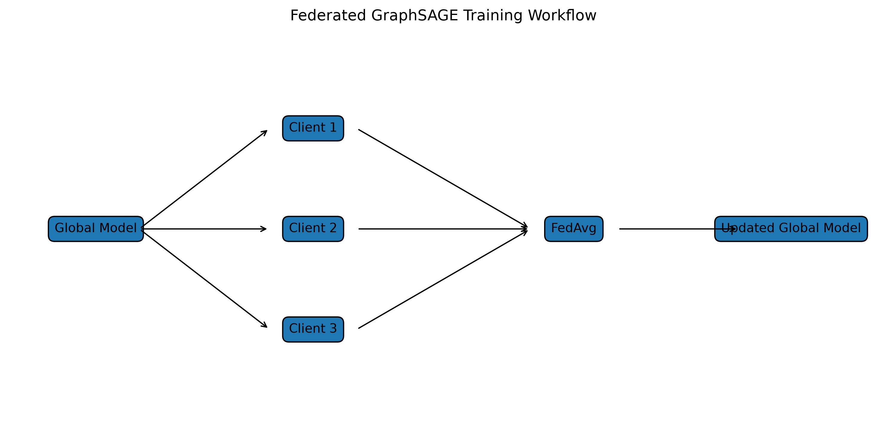
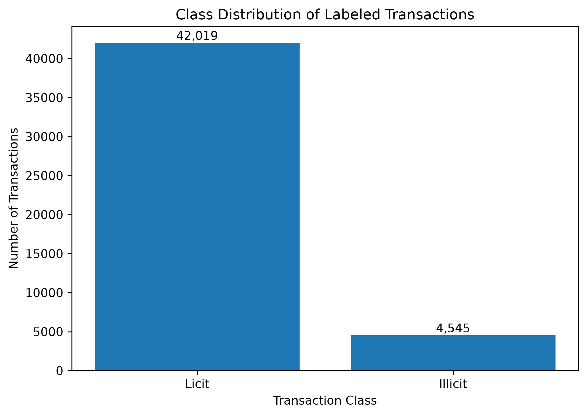
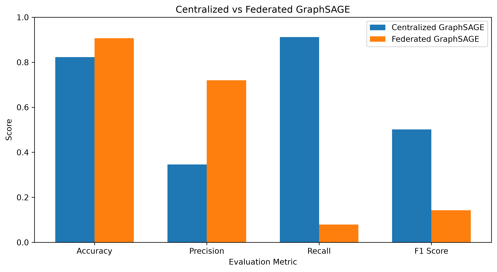

# Federated GraphSAGE for Illicit Transaction Detection

## Overview

This project explores **Federated Graph Learning (FGL)** for illicit Bitcoin transaction detection using the **Elliptic Bitcoin Transaction Dataset**.

A centralized GraphSAGE model is first developed as a baseline for classifying transactions as licit or illicit. The project then simulates a federated learning environment with three clients, where each client trains a local GraphSAGE model using its assigned training nodes.

The locally trained model parameters are combined using **Federated Averaging (FedAvg)** to create a global federated model.

The project is intended as a small-scale implementation for understanding the fundamental concepts of Federated Graph Learning before extending them to more complex privacy-preserving and cross-organizational systems.

### Federated Learning Workflow



The workflow illustrates the basic federated training process used in this project. The global model is distributed to the simulated clients, each client performs local training, and the resulting model parameters are aggregated using FedAvg to update the global model.

---

## Dataset

The project uses the **Elliptic Bitcoin Transaction Dataset**, which represents Bitcoin transactions as a graph.

The dataset contains:

* **203,769 transaction nodes**
* **234,355 original directed transaction edges**
* **165 transaction features**
* **42,019 licit transactions**
* **4,545 illicit transactions**
* **157,205 transactions with unknown labels**

Transactions with known labels are used for supervised training and evaluation, while unknown transactions remain part of the graph and can contribute neighborhood information during GraphSAGE message passing.

For model training, the original labels are converted as follows:

* Licit transaction → `0`
* Illicit transaction → `1`

### Class Distribution



The class distribution shows that the labeled portion of the dataset is highly imbalanced, with substantially fewer illicit transactions than licit transactions.

---

## Problem

Illicit transaction detection is a highly imbalanced classification problem because the number of licit transactions is substantially larger than the number of illicit transactions.

This means that overall accuracy alone may not provide a reliable indication of model performance. Therefore, the experiments also evaluate **precision, recall, and F1-score for the illicit class**.

---

## Methodology

The project follows these main stages:

1. Dataset exploration
2. Data preprocessing
3. Transaction graph construction
4. Feature normalization
5. Centralized GraphSAGE training
6. Baseline evaluation
7. Federated client simulation
8. Local GraphSAGE training
9. Federated Averaging
10. Federated model evaluation
11. Comparison of different loss-weighting strategies

---

## Graph Construction

Each Bitcoin transaction is represented as a **node**, while transaction relationships from the edge list are represented as **edges**.

The original directed transaction relationships are converted into an undirected representation by adding reverse edges.

The resulting graph contains:

* **203,769 nodes**
* **468,710 directed edge entries after adding reverse connections**
* **165 features per node**

The complete transaction graph is used for GraphSAGE message passing.

---

## GraphSAGE Model

The node-classification model uses a two-layer **GraphSAGE** architecture implemented with PyTorch Geometric.

The model consists of:

* GraphSAGE convolution layer
* ReLU activation
* GraphSAGE output layer

The first layer transforms the original 165 transaction features into a hidden representation of 64 dimensions. The second layer produces scores for the two output classes: licit and illicit.

---

## Federated Learning

The centralized training nodes are divided among **three simulated federated clients**.

Each client receives its own subset of labeled training nodes and trains a local GraphSAGE model. The local loss is calculated using only the training nodes assigned to that client.

After local training, the client model parameters are aggregated to update a shared global model.

This implementation is a learning-oriented federated simulation performed within a single notebook rather than a deployment across separate physical organizations or machines.

---

## Federated Averaging

The project uses **Federated Averaging (FedAvg)** to combine the parameters learned by the local client models.

The general federated workflow is:

**Global Model → Local Client Training → Model Parameter Aggregation → Updated Global Model**

Multiple communication rounds are simulated to observe how the global model changes during federated training.

---

## Experiments

Three federated loss configurations are evaluated.

### Strong Class Weighting

A strongly weighted loss gives substantially more importance to the minority illicit class.

This configuration achieves very high illicit recall but also produces a large number of false-positive predictions.

### Unweighted Loss

Standard cross-entropy loss is used without additional class weighting.

This configuration achieves high overall accuracy but detects very few illicit transactions.

### Moderate Class Weighting

A moderate weighting strategy assigns weights of `1.0` to the licit class and `3.0` to the illicit class.

This experiment investigates whether a less aggressive weighting strategy can provide a better trade-off between illicit detection and false-positive predictions.

---

## Results

The centralized and federated GraphSAGE configurations produced the following test results:

| Model                       | Accuracy | Illicit Precision | Illicit Recall | Illicit F1 |
| --------------------------- | -------: | ----------------: | -------------: | ---------: |
| Centralized GraphSAGE       |   82.30% |            34.59% |         91.20% |     50.16% |
| Federated - Unweighted      |   90.48% |            94.74% |          2.64% |      5.14% |
| Federated - Moderate Weight |   90.71% |            72.00% |          7.92% |     14.27% |
| Federated - Strong Weight   |   50.88% |            16.43% |         98.68% |     28.18% |

Although the unweighted and moderate-weight federated models achieve higher overall accuracy than the centralized model, their illicit recall is very low.

The centralized GraphSAGE model provides the strongest overall balance between precision and recall and achieves the highest illicit-class F1-score of **50.16%**.

The strongly weighted federated model achieves the highest illicit recall at **98.68%**, but this comes at the cost of a large number of false-positive predictions.

These results demonstrate why accuracy alone should not be used to evaluate performance on a highly imbalanced dataset.

### Model Comparison



The comparison figure shows the centralized GraphSAGE model against the moderate-weight federated configuration across accuracy, illicit precision, illicit recall, and illicit F1-score.

The moderate-weight federated model achieves higher accuracy and precision, while the centralized model achieves substantially higher illicit recall and F1-score.

---

## Limitations

This project is a **learning-oriented Federated Graph Learning simulation** rather than a fully distributed federated deployment.

Although the labeled training nodes are divided among three simulated clients and each client calculates its training loss using only its assigned nodes, all clients use the same overall transaction graph for GraphSAGE message passing. Therefore, the current experiment does not provide complete graph-data isolation between clients.

Other limitations include:

* Only three simulated clients are used.
* Only a small number of federated communication rounds are evaluated.
* The experiments are performed within a single notebook rather than across separate machines.
* Differential privacy is not implemented.
* Secure aggregation is not implemented.
* Permissioned blockchain integration is outside the scope of this mini-project.
* The highly imbalanced dataset makes model evaluation particularly sensitive to the chosen loss-weighting strategy.

---

## Future Work

Future development could extend this project by:

* Creating fully isolated local graphs for individual clients
* Increasing the number of federated clients
* Running additional federated communication rounds
* Improving reproducibility through fixed random seeds and model checkpointing
* Investigating additional class-imbalance strategies
* Implementing secure aggregation
* Exploring differential privacy
* Evaluating alternative graph neural network architectures
* Integrating federated graph learning with a permissioned blockchain framework

These extensions could move the current learning-oriented simulation toward a more realistic privacy-preserving cross-organizational system.

---

## Project Structure

```text
Federated-Graph-Learning-Project/
│
├── federated_graphsage.ipynb
├── README.md
├── results.md
├── .gitignore
│
├── images/
│   ├── class_distribution.png
│   ├── federated_workflow.png
│   └── model_comparison.png
│
└── data/
```

The main implementation and experiments are contained in `federated_graphsage.ipynb`.

Detailed experimental results are recorded in `results.md`.

---

## How to Run

### 1. Clone the Repository

```bash
git clone <repository-url>
cd Federated-Graph-Learning-Project
```

Replace `<repository-url>` with the URL of this GitHub repository.

### 2. Create a Virtual Environment

```powershell
py -3.14 -m venv .venv
```

### 3. Activate the Virtual Environment

On Windows PowerShell:

```powershell
.venv\Scripts\Activate.ps1
```

### 4. Install the Required Libraries

```powershell
python -m pip install numpy pandas matplotlib torch torch-geometric ipykernel
```

### 5. Prepare the Dataset

Place the Elliptic Bitcoin dataset files inside the project's `data` directory.

The notebook uses the transaction features, transaction classes, and transaction edge-list files from the Elliptic dataset.

### 6. Open the Notebook

Open:

```text
federated_graphsage.ipynb
```

in VS Code or Jupyter and select the project's `.venv` Python environment as the notebook kernel.

Run the notebook cells in order to reproduce the data preprocessing, graph construction, centralized GraphSAGE training, federated simulations, evaluation, and visualizations.

---

## Technologies

* Python
* PyTorch
* PyTorch Geometric
* NumPy
* pandas
* Matplotlib
* Jupyter Notebook
* Git

---

## Conclusion

This project demonstrates an introductory workflow for **Federated Graph Learning using GraphSAGE**.

It establishes a centralized GraphSAGE baseline, simulates multiple federated clients, performs local model training and Federated Averaging, and evaluates how different class-weighting strategies affect illicit transaction detection.

The experiments also highlight an important challenge in imbalanced graph classification: **high overall accuracy does not necessarily mean that a model effectively detects the minority illicit class**.

The project provides a practical foundation for further work involving privacy-preserving Federated Graph Learning and more realistic cross-organizational learning environments.
